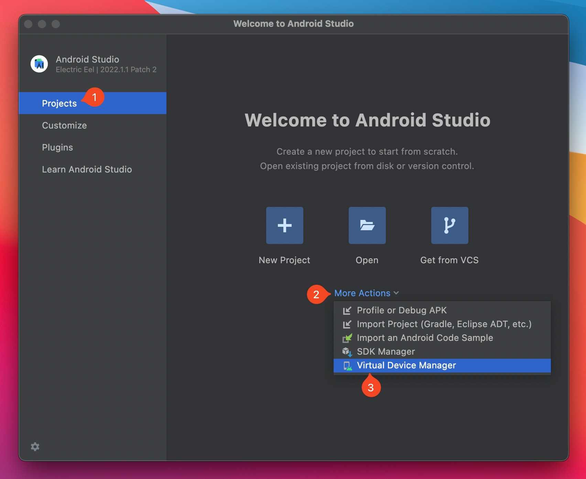
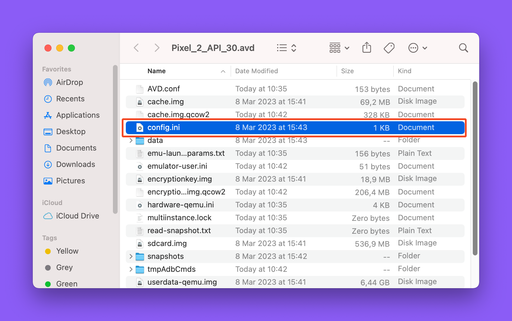
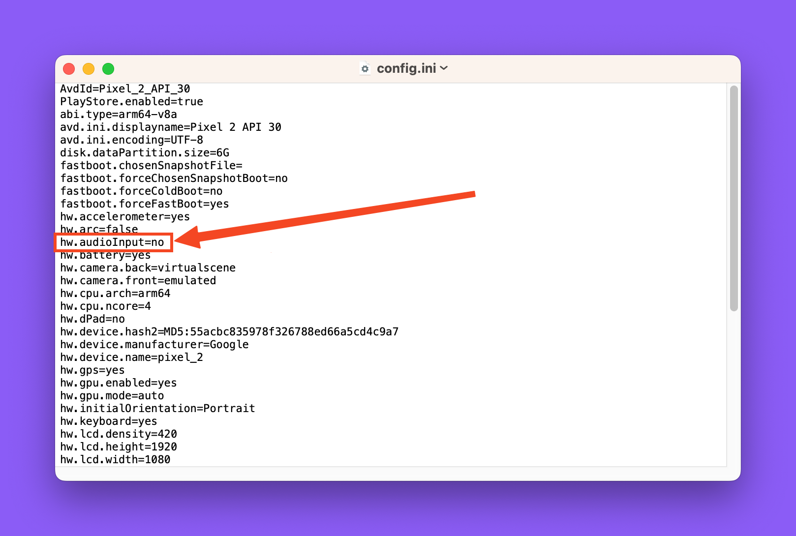

## Solution

1. Open Android Studio -> Projects -> More Actions -> Virtual Device Manager



2. Looking for a file named `config.ini` and open it with TextEdit (or any text editor you prefer).



3. Find this line and replace `yes` to `no`

```diff noLineNumbers
- hw.audioInput=yes
+ hw.audioInput=no
```



4. Save the file and re-open your emulator to see if it work.
